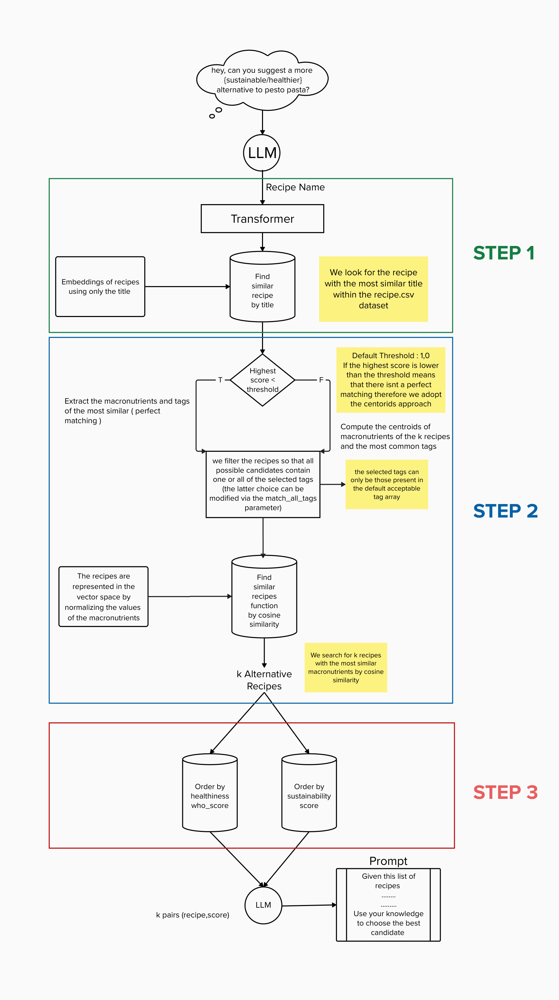

# SustainaMeal

Colab Demo : [](https://colab.research.google.com/drive/1CrBaq3qkM7sMzpeiNR4_92MjUwxM6UQD?usp=sharing)


## Introduction
`SustainaMeal` is a Python library designed to suggest alternative recipes for healthier or more sustainable options. Leveraging machine learning and natural language processing, it compares nutritional profiles and semantic similarities to provide recipe recommendations.

## Architecture
The library consists of several modules:

- **Data Preprocessing**: Remove unnecessary recipe data.
- **Transformer Embeddings**: Generates text embeddings for recipe titles using a transformer model.
- **Nutritional Vector Space**: Maps recipes into a vector space based on nutritional content.
- **Similarity Search**: Executes cosine similarity searches for finding matching recipes.
- **Sort results**: Sorts recipes based on healthiness or sustainability metrics.



## How to use?
### Installation
Install `SustainaMeal` using pip:

```bash
pip install git+https://github.com/GiovTemp/SustainaMeal.git
```

### Initialization
Initializes the system by loading the data and preparing the embeddings.

#### Class Definition :

    def __init__(self, recipes_df, nutrients,
                 transformer_name='davanstrien/autotrain-recipes-2451975973'):
        """
        Initializes the system by loading the data and preparing the embeddings.

        :param recipe_df: Datframe containing the recipes.
        :param nutrients: List of nutrient names to use.
        :param transformer_name: Name of the transformer model to use for embeddings.

        """

#### Usage :


```bash
from sustainameal import SustainaMeal

sm = SustainaMeal(
    recipes_df="recipes_df",
    nutrients=['calories', 'fat', 'protein', ...],
    transformer_name='your_transformer_model'
) 
```

     

Default Transformer used [davanstrien/autotrain-recipes-2451975973](https://huggingface.co/davanstrien/autotrain-recipes-2451975973)
### Find similar recipes 

Use the find_similar_recipes function to get the alternative recipes based on macronutrients similarity based on macronutrients similarity (Step 1 & 2 of the Architecture Diagram) .

#### Function Definition :
    def find_similar_recipes(self, input_text, k, acceptable_tags, match_all_tags):
        """
        Finds recipes similar to the given input text.

        :param input_text: The input text to find similar recipes for.
        :param k: Number of similar recipes to return.
        :param acceptable_tags: List of tags considered acceptable for filtering recipes.
        :param match_all_tags: Matching strategy
        :return: A list of tuples with similar recipes and their similarity scores.
        """


#### Usage :

```bash
similar_recipes = sm.find_similar_recipes(
                                          input_text='Creamy Lemon Asparagus Risotto', 
                                          k=10,
                                          acceptable_tags=['appetizers', 'main-dish', 'side-dishes', 'fruits', 'desserts',
                                                            'breakfast', 'pasta-rice-and-grains', 'beverages', 'drinks'],
                                          match_all_tags=True
                                          )
```


### Order by healthiness score

Use the order_recipe_by_healthiness to sort the recipes (Step 3 of the Architecture Diagram) .
#### Function Definition :

    def order_recipe_by_healthiness(self, nearest_recipes=None, score='who_score'):

        """
        Order the recipes obtained previously.

        :param (optional) nearest_recipes: Dataframe to order, if none the dataframe computed by find_similar_recipes will be used.
        :param score: The column name used as the primary sorting criterion.
        :return: A DataFrame of recipes ordered by the specified score.

        """

#### Usage 

- Sorts the DataFrame produced by 'find_similar_recipes', assuming it has been executed before.


```bash
healthier_recipes = sm.order_recipe_by_healthiness(score="who_score")
```

- Sort a different dataframe than the one computed by 'find_similar_recipes' (for example is useful for reordering a subset of the previous dataframe )

```bash
healthier_recipes = sm.order_recipe_by_healthiness(
                                                    nearest_recipes=your_df,
                                                    score="who_score"
                                                  )
```

### Order by sustanability score

Use the order_recipe_by_sustainability to sort the recipes (Step 3 of the Architecture Diagram) .

#### Function Definition :

    def order_recipe_by_sustainability(self, nearest_recipes=None, score='sustainability_label',
                                       secondary_sort_field='who_score'):

        """
        Order the recipes obtained previously.

        :param (optional) nearest_recipes: Dataframe to order , if none the dataframe computed by find_similar_recipes will be used.
        :param score: The column name used as the primary sorting criterion.
        :param secondary_sort_field: The column name used as the secondary sorting criterion.
        :return: A Dataframe with recipes ordered by the given metric.
        """

#### Usage 

- Sorts the DataFrame produced by 'find_similar_recipes', assuming it has been executed before.
```bash
order_by_sus_recipes = sm.order_recipe_by_sustainability(score='sustainability_label')
```

- Sort a different dataframe than the one computed by 'find_similar_recipes' (for example is useful for reordering a subset of the previous dataframe )
```bash
order_by_sus_recipes = sm.order_recipe_by_sustainability(
                                                    nearest_recipes=your_df,
                                                    score="sustainability_label"
                                                  )
```


## Display the recommendations
```bash
for recipe in order_by_sus_recipes:
    print(recipe)
```


